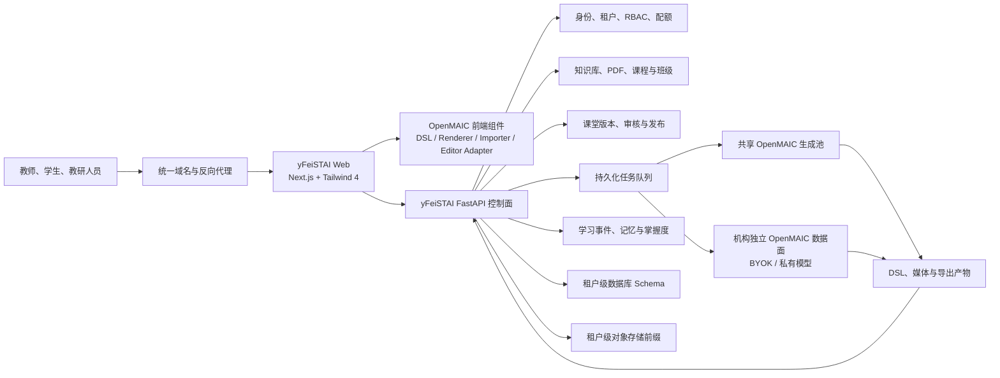

# yFeiSTAI × OpenMAIC 融合设计

> 状态：已批准
>
> 日期：2026-07-28
>
> 设计基线：yFeiSTAI 当前工作区；OpenMAIC `0.3.1`

## 1. 背景与结论

yFeiSTAI 已具备账号入口、知识库、记忆、解题、掌握度、Agent
Capability、StreamBus 和教学场景扩展基础。OpenMAIC 的优势集中在互动课堂
大纲与场景生成、课堂 DSL、幻灯片和互动内容渲染、编辑、播放及导出。

本设计选择“**契约驱动的模块化吸收**”：

- yFeiSTAI 是主平台、唯一身份源、业务控制面和学习数据事实源。
- OpenMAIC 是独立部署的课堂生成与导出引擎。
- yFeiSTAI 前端直接集成 OpenMAIC DSL、Renderer、Importer 和必要编辑器能力，
  不使用 iframe 或独立 OpenMAIC 应用页面。
- 双方通过稳定的课堂文档、异步任务和学习事件契约协作，不合并账号、知识库、
  Provider 配置、记忆或掌握度存储。
- 标准机构共享计算资源；有 BYOK、私有模型或数据不出域要求的机构使用独立
  OpenMAIC 数据面。

该方向符合
[《教培行业优化方案》](../../教培行业优化方案.md)提出的二次开发纪律：
新业务闭环归入 pipeline capability 或数据面 REST，产出继续使用统一事件出口，
定制层保持浅层和插件化，避免深 Fork。

## 2. 已批准的产品决策

1. **主平台**：保留 yFeiSTAI 的账号、知识库、记忆、解题、掌握度和教学管理；
   OpenMAIC 负责课堂生成、编辑、播放和导出。
2. **首期范围**：教师备课与发布、学生按需生成、教研内容运营三条业务线全部包含。
3. **部署**：与 yFeiSTAI 同环境私有化部署，使用独立容器和统一域名反向代理。
4. **身份**：用户只登录 yFeiSTAI；OpenMAIC 不公开登录，也不独立维护账号。
5. **租户**：一套 yFeiSTAI 同时服务多个独立机构。
6. **隔离**：共享 Web、API、任务队列和计算池；数据库 Schema/命名空间、
   对象存储前缀、密钥和配额按租户隔离，并支持独立数据面。
7. **模型**：标准租户使用平台 Provider；特殊租户使用机构自己的 Provider 和
   独立 OpenMAIC 数据面。
8. **前端**：采用 SDK 优先的直接组件合并；不采用 iframe 或微前端。
9. **样式**：yFeiSTAI Web 全站升级到 Tailwind 4。
10. **内容模式**：同时提供来源约束和开放创作；教师默认来源约束。
11. **学生生成**：学生自行选择微课堂或完整课堂，受课程策略、分级配额和超额
    审批约束。
12. **审核**：班级级可自治、机构级双人审核、平台级强制审核；发布后版本不可变。
13. **生成方式**：教师、教研和学生完整课堂采用两阶段生成；学生微课堂可直接生成。
14. **学习数据**：yFeiSTAI 是唯一事实源；OpenMAIC 仅发送标准化事件。
15. **首期容量**：50 个机构、10 万注册用户、1 万日活、200 个同时在线课堂、
    平台 20 个生成并发、标准租户默认 2 个生成并发。

## 3. 目标与非目标

### 3.1 目标

- 在 yFeiSTAI 内完成课堂创建、编辑、审核、发布、学习和进度回传。
- 从知识库或 PDF 生成有知识点映射和来源追踪的互动课堂。
- 支持学生按需生成个人微课堂或完整课堂，并控制成本与内容风险。
- 支持教研人员批量生成、逐项审核、版本管理和机构资源沉淀。
- 保证身份、租户、Provider 密钥、知识库和学习数据的隔离。
- 保持 OpenMAIC 升级能力，避免形成无法跟随上游的深度 Fork。

### 3.2 非目标

首期不建设以下能力：

- 家长端或助教专属产品界面；
- 实时多人协同编辑；
- 跨机构课程交易市场；
- 学生将个人课堂直接公开发布；
- 自动迁移正在学习的班级到新版本；
- OpenMAIC 独立账号和登录系统；
- 通用模型训练或微调平台。

## 4. 方案比较与选择

### 4.1 方案 A：契约驱动的模块化吸收（采用）

yFeiSTAI 前端直接集成 OpenMAIC 公共包和窄化编辑器包；OpenMAIC 生成服务以
独立 Node 服务运行；yFeiSTAI 通过适配器、任务契约和事件契约控制整个生命周期。

优点：

- 用户体验统一；
- 身份、租户和学习闭环不产生双主；
- Python 控制面和 Node 生成引擎边界清晰；
- 可精确锁定并逐步升级 OpenMAIC；
- 符合 yFeiSTAI 的浅定制和插件化原则。

代价：

- 需要维护 OpenMAIC 兼容适配层；
- 需要对尚未完全稳定的编辑器能力做窄接口封装；
- Tailwind 4 升级需要单独的全站视觉回归门禁。

### 4.2 方案 B：深度源码合并（不采用）

将 OpenMAIC 前端、生成 API、存储和业务代码整体搬入 yFeiSTAI。短期修改自由，
但会混淆 Python 与 Node 职责，显著增加升级冲突和安全补丁成本。

### 4.3 方案 C：独立页面或微前端接入（不采用）

通过 iframe、独立页面或微前端保留完整 OpenMAIC 应用。实施较快，但会造成导航、
主题、状态和权限割裂，不符合已批准的直接组件合并目标。

## 5. 总体架构



### 5.1 系统职责

| 领域 | 唯一负责方 |
|---|---|
| 登录、机构、成员、角色、权限 | yFeiSTAI |
| 知识库、PDF、课程、班级、知识点 | yFeiSTAI |
| 课堂记录、版本、审核、发布、分配 | yFeiSTAI |
| 课堂 DSL 校验、渲染和前端编辑 | yFeiSTAI 内的 OpenMAIC 组件 |
| 大纲、场景、测验、PBL、互动内容、媒体和导出生成 | OpenMAIC 服务 |
| 任务状态、配额、审计和正式产物 | yFeiSTAI |
| 学习事件、记忆、掌握度和教学报表 | yFeiSTAI |

### 5.2 信任边界

- 浏览器只持有 yFeiSTAI 登录态，不能携带 Provider 密钥调用 OpenMAIC。
- 生成请求必须经过 yFeiSTAI 的权限、租户、策略和配额校验。
- OpenMAIC 共享池只获得当前任务所需的教学简报和来源片段，不得直接遍历租户
  知识库。
- yFeiSTAI 与 OpenMAIC 的服务调用只经过私有网络，并使用双向 TLS 或等价的
  服务身份凭证；OpenMAIC 必须校验调用方、目标数据面和任务租户。
- OpenMAIC 临时工作目录不是正式存储；通过校验的 DSL、媒体和导出文件必须回收
  到 yFeiSTAI 的租户存储。
- 流式进度或大文件传输确需浏览器直连时，yFeiSTAI 签发短期、限动作的课堂票据，
  反向代理仅开放相应受控路径。

## 6. 组件与模块

### 6.1 yFeiSTAI 领域模块

| 模块 | 职责 |
|---|---|
| `ClassroomDomain` | 课堂、版本、来源、发布、班级分配和生命周期 |
| `TeachingBriefBuilder` | 将知识库/PDF转换为教学目标、知识点、来源片段和引用约束 |
| `GenerationOrchestrator` | 两阶段生成、任务编排、配额、重试、取消和结果晋级 |
| `OpenMAICClient` | 健康检查、提交、轮询、取消、产物获取和版本兼容 |
| `ReviewWorkflow` | 班级自治发布、机构双人审核和平台级审核 |
| `LearningEventIngestor` | 幂等接收事件，驱动记录、报告、记忆和掌握度 |
| `ClassroomPolicy` | 模型路由、来源模式、联网策略、学生权限和配额 |
| `openmaic-adapter` | 封装前端 DSL、Renderer、Importer 和编辑器组件 |

模块名称表达职责，实际实现路径应在实施计划中按现有项目目录和依赖方向落位。

### 6.2 OpenMAIC 前端能力

- `@openmaic/dsl`：课堂文档类型、校验和迁移的基础。
- `@openmaic/renderer`：教师预览和学生播放。
- `@openmaic/importer`：承接 OpenMAIC 支持的内容导入。
- 编辑器：提取为窄接口、精确锁版本的内部包。业务页面不直接依赖 OpenMAIC
  内部 Store、路由或账号状态。
- 所有使用集中在 `openmaic-adapter`，以便处理 DSL 迁移、主题映射、事件转换和
  上游破坏性变更。

### 6.3 多入口复用

- 教师、审核、发布和内容运营通过 REST API 调用领域服务。
- 学生在聊天中提出生成请求时，由新的 `interactive_classroom` pipeline
  capability 收集需求并调用同一个 `GenerationOrchestrator`。
- Capability 的对话进度继续走 StreamBus，并通过统一 capability result 出口完成
  回合。
- 生成任务必须进入持久化队列；StreamBus 只负责实时表现，不承担任务持久性。
- 批量生产可由现有 cron 能力触发，但仍使用同一任务、配额和审核模型。

该划分与
[《项目架构分析》](../../项目架构分析.md)记录的 Loop Capability、Pipeline
Capability、REST 数据面和 StreamBus 职责保持一致。

## 7. 稳定协作契约

### 7.1 `TeachingBrief`

至少包含：

- 租户、课程和目标班级上下文；
- 学段、受众水平、教学目标、预计时长和课堂模式；
- 知识点列表、先修关系和预期测评方式；
- 来源快照、允许使用的片段、来源引用和权限摘要；
- 来源约束或开放创作模式；
- 联网、媒体、模板和安全策略；
- 简报版本及内容哈希。

来源约束模式下，OpenMAIC 只能根据简报中的授权片段生成。开放创作模式必须
显式标记，并受租户联网策略控制。

### 7.2 `GenerationRequest`

至少包含：

- 租户与请求身份；
- `TeachingBrief` 标识和哈希；
- 微课堂或完整课堂；
- 大纲阶段或完整内容阶段；
- 已确认的大纲版本；
- 模板、场景预算、时长和导出需求；
- Provider 路由标识，不包含客户端 Provider 密钥；
- 幂等键、优先级和回调上下文。

### 7.3 `ClassroomDocument`

至少包含：

- OpenMAIC DSL 与 DSL 版本；
- 课堂、舞台、场景和互动单元标识；
- 知识点映射；
- `sourceRefs` 和开放创作标记；
- 媒体清单、文件哈希和导出清单；
- 生成模型、模板、简报与父版本的可审计元数据；
- 校验结果和兼容迁移记录。

### 7.4 `GenerationJob`

至少包含：

- 租户、请求、课堂草稿和批次标识；
- 当前阶段、进度、尝试次数和工作池；
- 配额预留、模型及实际费用；
- 心跳、租约、错误分类和诊断摘要；
- 临时产物与正式产物状态；
- 创建、开始、结束和取消时间。

### 7.5 `LearningEvent`

至少包含：

- `event_id` 和事件 schema 版本；
- `tenant_id`、`user_id`、`session_id`；
- `classroom_version_id`、`scene_id`、`knowledge_point_id`；
- 事件类型、发生时间和必要结果载荷；
- 来源票据或会话签名上下文。

首期标准事件：

- `classroom.started`
- `scene.completed`
- `quiz.graded`
- `hint.used`
- `pbl.milestone_completed`
- `classroom.completed`

## 8. 领域数据模型

| 实体 | 作用 |
|---|---|
| `Tenant` | 机构、状态、套餐、策略和数据面路由 |
| `TenantMembership` / `RoleGrant` | 用户在租户及资源范围内的权限 |
| `Course` / `Class` / `Enrollment` | 课程、班级和成员关系 |
| `SourceSnapshot` | 生成时使用的来源版本、权限、哈希和引用 |
| `TeachingBrief` | 两阶段生成的稳定输入 |
| `ClassroomAsset` | 课堂的稳定逻辑身份 |
| `ClassroomVersion` | 不可变 DSL、媒体、来源和生成元数据 |
| `GenerationJob` / `BatchJob` | 单项任务与批次聚合 |
| `Approval` | 提交、审核、退回、批准和自审约束 |
| `Publication` / `Assignment` | 发布范围、班级分配和固定版本 |
| `LearningSession` | 一次学习过程及断点状态 |
| `LearningEvent` / `QuizAttempt` | 原始行为和可评分结果 |
| `QuotaLedger` | 预留、结算、释放和人工调整 |

所有租户业务实体即使位于独立 Schema，也保留可验证的租户归属。任何跨越 API、
队列、缓存、存储或日志边界的标识都必须携带租户上下文。

## 9. 三条首期业务流程

### 9.1 教师备课与发布

1. 教师选择知识库/PDF、课程、班级、模板、时长和内容模式。
2. yFeiSTAI 校验来源权限并生成带哈希的 `TeachingBrief`。
3. OpenMAIC 第一阶段生成大纲、知识点覆盖和场景结构。
4. 教师调整并确认大纲。
5. OpenMAIC 第二阶段生成完整 DSL、互动内容和媒体。
6. yFeiSTAI 执行 DSL、来源、资源、互动和可访问性校验。
7. 教师在 yFeiSTAI 内编辑和预览。
8. 根据机构策略直接发布到本人班级，或提交审核。
9. 发布时冻结不可变版本并分配给班级。
10. 学生学习后，标准事件回传 yFeiSTAI。

### 9.2 学生按需生成

1. 学生在聊天中提出问题并选择微课堂或完整课堂。
2. 系统检查课程是否允许、租户策略、学生配额、内容安全和审批条件。
3. 默认使用当前课程知识库和问题构建来源约束简报；只有租户授权时才允许开放
   创作或联网。
4. 微课堂直接生成；完整课堂先展示大纲，由学生确认后生成完整内容。
5. 学生课堂默认仅本人可见。
6. 教师可将优质学生课堂复制为新的教师草稿；学生版本不能直接公开发布。
7. 仅有效测评结果参与掌握度更新。

配额规则：

- 微课堂使用普通额度；
- 完整课堂使用更高额度；
- 课程必须显式允许学生生成完整课堂；
- 超额请求进入教师审批；
- 未成年人、受限主题或联网内容可由策略强制审批；
- 提交前展示预计场景、时间和额度。

### 9.3 内容运营生产

1. `content_author` 选择多个来源、课程范围、模板和生成参数。
2. 每个输入形成独立 `GenerationJob`，并归属一个 `BatchJob`。
3. 批量任务允许部分成功；失败项目单独重试，成功项目不重新生成。
4. 作者逐项或批量编辑后送审。
5. `content_reviewer` 审核，默认禁止审核本人创建的内容。
6. 通过后发布到机构资源库；平台公共模板必须由平台级审核。
7. 后续修改创建新版本，保留原发布记录和使用关系。

## 10. 审核、发布与版本

### 10.1 审核规则

- 教师自建课堂：教师预览后可发布到自己的班级；机构可配置为必须审核。
- 机构资源库：作者与审核人分离，默认禁止自审。
- 平台公共模板库：必须经过平台级审核。
- 退回必须记录原因；重新送审形成新的审核记录。

### 10.2 不可变版本

```text
ClassroomAsset
 ├─ v1：已发布，班级 A 正在学习
 ├─ v2：修改后的审核中版本
 └─ v3：未来草稿
```

- 已发布课堂不能原地覆盖。
- 修改时基于旧版本创建新草稿。
- 班级分配固定到具体 `ClassroomVersion`。
- 正在学习的班级继续使用旧版本。
- 教师明确迁移后，新进入的学习会话才切换版本。
- 迁移记录包含操作者、来源版本、目标版本、时间和受影响班级。

### 10.3 状态模型

用户可见的课堂生命周期为：

```text
draft
  → outline_generating
  → outline_ready
  → content_generating
  → editing
  → in_review
  → approved
  → published
  → archived
```

实现时将课堂发布状态和生成任务状态分别存储，再投影为上述生命周期，防止一次
生成失败污染已经批准或发布的课堂版本。

## 11. 多租户、权限与安全

### 11.1 角色、权限与范围

系统采用“角色 + 权限 + 资源范围”，不得在业务代码中硬编码角色判断。

| 默认角色 | 默认范围 |
|---|---|
| `platform_admin` | 平台租户、公共模板和平台策略 |
| `org_admin` | 当前机构全部课程、班级、成员和策略 |
| `content_author` | 机构内容创建、编辑和送审 |
| `content_reviewer` | 机构内容审核和退回 |
| `teacher` | 被授权课程及本人班级 |
| `student` | 本人加入的课程、班级和个人课堂 |

基础权限包括：

- `classroom.create`
- `classroom.edit`
- `classroom.submit`
- `classroom.approve`
- `classroom.publish`
- `classroom.assign`
- `classroom.generate.micro`
- `classroom.generate.full`
- `source.use`
- `learning_event.read`

权限可绑定机构、课程或班级。未来增加助教、审计员或家长时，通过新的默认授权
组合完成，不改变领域规则。

### 11.2 身份与课堂票据

yFeiSTAI 是唯一身份源。OpenMAIC 不维护用户密码、会话或登录入口。

短期票据至少绑定：

- `issuer`
- `audience`
- `tenant_id`
- `user_id`
- `classroom_version_id` 或 `job_id`
- `allowed_action`
- `expiry`
- `jti`

写操作票据一次性使用，默认有效期不超过五分钟。OpenMAIC 不得根据客户端参数
切换租户、数据面或 Provider。

课堂票据只解决受控的浏览器传输场景。yFeiSTAI API、队列工作进程与 OpenMAIC
之间使用独立服务身份，不复用用户票据，也不把机构 Provider 密钥放入任务消息。

### 11.3 数据隔离

- 平台控制域保存租户目录、用户、成员关系和数据面路由。
- 租户业务数据使用独立数据库 Schema 或等价命名空间。
- 对象存储使用租户前缀、租户密钥、生命周期和容量配额。
- API 从已验证登录态解析租户，不接受客户端自报 `tenant_id`。
- 队列消息、缓存键、幂等键、审计和日志都包含租户边界。
- Provider 密钥仅存在服务端密钥系统或独立数据面。
- 原始学习事件、导出和删除周期由租户策略控制，并保留管理员审计。

### 11.4 分层 Provider 与数据面

- 标准租户使用平台配置的 Provider 和共享 OpenMAIC 工作池。
- BYOK、私有 API、私有模型或数据不出域租户路由到独立 OpenMAIC 数据面。
- 独立数据面使用机构自己的 Provider、密钥和必要存储。
- 控制面接口、任务契约、课堂 DSL 和事件契约保持一致。
- 共享工作池不得收到独立数据面的 Provider 密钥或完整来源正文。

## 12. 来源约束与内容治理

### 12.1 来源约束模式

教师和教研默认使用该模式：

- 来源在生成前进行权限校验并形成不可变快照；
- `TeachingBrief` 只携带允许使用的片段；
- 每个场景保存 `sourceRefs`；
- 审核界面展示知识点覆盖率、引用片段和无来源支撑内容；
- 原始 PDF 或知识库全文不直接暴露给 OpenMAIC 共享池或学生。

### 12.2 开放创作模式

- 界面和课堂元数据明确标识为开放创作；
- 是否允许联网由租户和课程策略决定；
- 联网资料保存链接、访问时间和引用；
- 学生默认不能跨课程知识库检索；
- 未成年人和受限主题可以被策略强制转入教师审批。

### 12.3 内容质量

生成通过不代表可以发布。发布前至少检查：

- DSL 和媒体完整性；
- 知识点覆盖；
- 来源追踪和版权策略；
- 测验答案及评分规则；
- 链接、互动组件和导出可用性；
- 安全策略和可访问性；
- 必要的人工审核。

## 13. 学习事件、记忆与掌握度

OpenMAIC Renderer 只产生标准事件；yFeiSTAI 负责接收、校验、存储和解释。

处理流程：

1. 前端使用 yFeiSTAI 会话上下文为事件补充用户、租户、课堂版本和学习会话。
2. API 校验票据、资源权限和事件 schema。
3. 按 `event_id` 幂等写入追加式原始事件。
4. 异步处理器更新学习记录、参与度、记忆和报告。
5. 只有绑定知识点且具备评分依据的结果进入掌握度引擎。

更新规则：

- 浏览、停留、翻页和提示只更新参与度或短期记忆。
- `quiz.graded` 和具有明确评价规则的 `pbl.milestone_completed` 才可能更新掌握度。
- 缺失知识点映射、签名无效或课堂版本不匹配的事件进入隔离队列。
- 浏览器本地状态只用于断点续学缓存，服务端记录是正式学习状态。
- 原始事件进入记忆短期层，聚合结果进入教学报表和长期学习画像。

## 14. 异步任务与失败恢复

### 14.1 任务投递

API 在同一事务中创建任务记录和 Outbox 消息，调度器再投递到队列，避免数据库
记录与队列消息不一致。

生成任务状态：

```text
created
  → quota_reserved
  → queued
  → generating_outline
  → awaiting_confirmation
  → generating_content
  → validating
  → materializing
  → succeeded / failed / canceled
```

### 14.2 公平调度

- 平台共享池首期默认总并发 20。
- 标准租户默认并发 2，可按套餐调整。
- 按租户公平调度，单一机构不能占满共享池。
- 优先级依次为学生微课堂、课堂内交互、教师备课、完整课堂、教研批量任务。
- 批量任务只使用所属租户的可用并发。
- 独立数据面任务进入专属队列或工作池。

### 14.3 幂等、重试和取消

- 重复提交同一幂等键返回原任务；显式“重新生成”创建新请求。
- 超时、限流、暂时不可用和工作进程中断可指数退避重试。
- 权限、策略、来源或确定性格式错误不自动重试。
- DSL 校验失败可执行有限次数的自动修复，仍失败则保留诊断并返回编辑环节。
- 工作进程使用租约和心跳，失联任务可被重新认领。
- 排队任务取消立即生效；运行任务尽力中止，残留产物不得晋级。
- 批量任务允许部分成功；超过重试次数的项目进入隔离队列。

### 14.4 原子产物晋级

1. OpenMAIC 写入临时 DSL、媒体和导出文件。
2. yFeiSTAI 校验 DSL 版本、文件清单、哈希、大小和安全策略。
3. 校验通过后统一晋级至租户正式存储。
4. 数据库事务创建不可变课堂版本。
5. 任一环节失败都不得出现半发布课堂。

### 14.5 配额结算

- 入队时预留预计额度；
- 成功后按实际模型、Token、媒体和导出成本结算；
- 失败或取消释放未使用额度；
- 前端提交前展示预计场景、时长和额度；
- 所有人工调整写入 `QuotaLedger` 和审计日志。

## 15. 前端集成与 Tailwind 4

### 15.1 直接组件合并

课堂生成、编辑、预览、播放和导出入口均属于 yFeiSTAI 页面和导航。业务页面只
依赖 `openmaic-adapter`，不直接依赖 OpenMAIC 应用路由、登录或全局状态。

适配层负责：

- DSL 读取、校验和迁移；
- yFeiSTAI 主题与 OpenMAIC Renderer 的样式映射；
- 编辑器命令与 yFeiSTAI 草稿保存契约转换；
- Renderer 事件到 `LearningEvent` 的转换；
- 媒体 URL、票据和导出下载；
- 上游版本兼容和降级提示。

### 15.2 Tailwind 4 迁移

OpenMAIC Renderer 的样式要求推动 yFeiSTAI Web 全站升级到 Tailwind 4。迁移是
独立发布门禁，不与课堂功能缺陷混在一起验收。

必须覆盖：

- 构建配置、全局 CSS、主题变量和内容扫描；
- 登录、聊天、知识库、设置和教学管理；
- 课堂生成、编辑、预览和播放；
- 明暗主题、中文和英文；
- 桌面与移动端主要断点；
- 第三方组件和 Markdown/富文本样式；
- 生产构建、类型检查和视觉回归。

如编辑器所需能力尚未形成稳定公共 SDK，只抽取首期必需的最小编辑接口，并保持
补丁可回馈上游；不得复制完整 OpenMAIC 应用。

## 16. 部署与运行观测

### 16.1 部署拓扑

同一私有化环境至少包含：

- yFeiSTAI Web；
- yFeiSTAI FastAPI；
- 持久化任务队列与调度器；
- 关系数据存储；
- 对象存储；
- OpenMAIC 共享生成工作池；
- 按需部署的机构独立 OpenMAIC 数据面；
- 统一反向代理、密钥和观测设施。

OpenMAIC 生成工作池可水平扩展。对外只暴露统一域名下的 yFeiSTAI 路由和少量
需要短期票据的受控传输路由。

### 16.2 观测指标

- 排队时长、各阶段耗时、成功率、取消率和重试率；
- DSL 校验与自动修复失败率；
- 各租户并发、配额和模型费用；
- 共享及独立数据面健康状态；
- 学习事件积压和掌握度聚合延迟；
- 临时产物积压、正式产物晋级和导出失败；
- 版本迁移、审核和发布审计。

日志通过 `tenant_id + job_id + classroom_version_id` 关联，但不得记录 Provider
密钥、完整来源正文或学生敏感内容。

### 16.3 OpenMAIC 升级

- OpenMAIC 和 DSL 使用精确版本，不使用漂移版本范围；
- 维护 yFeiSTAI、OpenMAIC、DSL 和编辑器包兼容矩阵；
- 升级前运行契约测试、迁移测试和代表性课堂回放；
- 新版本先进入灰度工作池；
- 失败时把新任务切回上一兼容工作池；
- 已发布课堂继续按原 DSL 版本渲染或通过经过验证的迁移器读取。

## 17. 验证与验收

### 17.1 端到端业务验收

| 领域 | 必须证明 |
|---|---|
| 教师流程 | 知识库/PDF → 大纲确认 → 完整生成 → 编辑 → 审核 → 发布 → 学习 |
| 学生流程 | 微课堂和完整课堂可选；课程策略、配额和超额审批生效 |
| 内容运营 | 批量部分成功、单项重试、禁止自审、审核后进入机构资源库 |
| 版本管理 | 发布版本不可覆盖；在学班级固定旧版本；迁移有操作和审计 |
| 学习闭环 | 重复事件不重复计分；只有有效测评改变掌握度 |
| 租户隔离 | 跨租户数据库、缓存、队列、文件和密钥访问全部失败 |
| 单一身份 | OpenMAIC 无公开登录；过期、越权和重放票据失败 |
| 来源约束 | 场景可追溯来源；无来源支撑内容可被审核界面识别 |
| 独立数据面 | 机构可使用自有 Provider，共享池无法获得其密钥和正文 |

### 17.2 契约与回归

- OpenMAIC DSL 合约、历史课堂迁移和错误输入测试；
- Renderer 快照、代表性课堂回放和导出验证；
- 前端适配器对上游版本差异的契约测试；
- `TeachingBrief`、`GenerationRequest`、`GenerationJob` 和 `LearningEvent`
  schema 兼容测试；
- yFeiSTAI Capability 统一结果和 StreamBus 状态测试；
- Provider 或 Prompt 变更后的教研回归集。

### 17.3 故障演练

- Provider 429、5xx 和超时；
- OpenMAIC 工作进程崩溃或心跳丢失；
- 队列或调度器重启；
- 重复任务和重复学习事件；
- 临时产物上传中断；
- DSL 校验与自动修复失败；
- 独立数据面离线；
- 批量任务部分失败；
- 新 OpenMAIC 工作池灰度失败和回退。

### 17.4 性能与容量

使用模拟 Provider 验证调度和平台容量，使用受控真实 Provider 验证代表性生成：

- 50 个机构；
- 10 万注册用户；
- 1 万日活；
- 200 个同时在线课堂的播放和事件回传；
- 平台 20 个并发生成任务；
- 标准租户默认 2 个生成并发和公平调度；
- 大规模课堂版本、事件、报表和配额账本索引。

首期运行目标：

- 非生成类核心 API 在正常负载下 `p95 < 500 ms`；
- 提交任务后 2 秒内展示排队或执行状态；
- 学习事件正常情况下 1 秒内接收；
- 掌握度聚合 60 秒内可见；
- 生成总时长不脱离 Provider 设置统一硬指标，但必须持续展示阶段、进度、
  等待原因和可取消状态。

### 17.5 Tailwind 4 与视觉验收

对登录、聊天、知识库、设置、教学管理、课堂编辑和课堂播放进行桌面及移动端截图
回归。验证生产构建、类型检查、主要交互、明暗主题和中英双语。课堂功能验收不能
替代全站迁移验收。

### 17.6 数据保护

- 租户 Schema 与对象存储前缀的备份和恢复演练；
- 课堂版本、来源快照和学习事件的一致性恢复；
- 租户级导出、保留和删除策略验证；
- 审计记录完整性和敏感日志检查。

## 18. 首期内部交付顺序

以下仅是同一首期版本内部的建设顺序，不是拆成多个对外版本：

1. 数据模型、身份、租户、权限、稳定契约和任务内核；
2. Tailwind 4 基础迁移并建立迁移前后的视觉基线；
3. OpenMAIC 生成适配与前端组件适配；
4. 教师备课、审核、发布和学习回传；
5. 学生微课堂、完整课堂、配额和审批；
6. 教研批量生产、双人审核和机构资源库；
7. Tailwind 4 全站回归、容量、安全、故障和恢复验证；
8. 三条业务线同时启用后发布首期版本。

## 19. 主要风险与控制

| 风险 | 控制措施 |
|---|---|
| OpenMAIC API、DSL 或内部编辑器变化 | 适配层、精确锁版本、兼容矩阵、契约和迁移测试 |
| 编辑器公共 SDK 不完整 | 只抽取窄接口，避免复制完整应用，保持上游可回馈 |
| Tailwind 4 引发全站回归 | 独立迁移门禁、页面矩阵、视觉回归和生产构建 |
| 多租户数据泄漏 | 服务端解析租户、Schema/前缀/密钥隔离、跨租户负向测试 |
| 来源幻觉或版权风险 | 来源快照、`sourceRefs`、无来源警告、人工审核和策略门禁 |
| 生成成本失控 | 两阶段生成、分级配额、预留结算、公平队列和审批 |
| Provider 质量漂移 | 服务端配置、模型 Profile、教研回归和灰度工作池 |
| 学习事件误改掌握度 | 事件幂等、知识点绑定、评分门禁和隔离队列 |
| 批量任务阻塞即时任务 | 租户并发、公平调度和优先级队列 |
| 深 Fork 导致无法升级 | 公共包优先、窄适配、稳定契约和最小上游补丁 |

## 20. 设计完成标准

本设计在以下条件同时满足时进入实施计划阶段：

- 六个设计章节和总体方向已经产品确认；
- yFeiSTAI 与 OpenMAIC 的系统边界和事实源唯一；
- 三条首期业务线共享同一领域、任务、版本和审核内核；
- 多租户、身份、Provider、来源和学习数据边界明确；
- 失败恢复、升级、容量和验收条件可验证；
- 实施不需要复制完整 OpenMAIC 应用或引入第二套账号体系。

## 21. 参考资料

### yFeiSTAI

- [教培行业优化方案](../../教培行业优化方案.md)
- [项目架构分析](../../项目架构分析.md)

### OpenMAIC 官方资料

- [项目 README](https://github.com/xinlingzhifei/OpenMAIC/blob/main/README.md)
- [package.json](https://github.com/xinlingzhifei/OpenMAIC/blob/main/package.json)
- [课堂生成流程](https://github.com/xinlingzhifei/OpenMAIC/blob/main/skills/openmaic/references/generate-flow.md)
- [DSL 包说明](https://github.com/xinlingzhifei/OpenMAIC/blob/main/packages/%40openmaic/dsl/README.md)
- [Renderer 包说明](https://github.com/xinlingzhifei/OpenMAIC/blob/main/packages/%40openmaic/renderer/README.md)
- [Renderer 编辑入口](https://github.com/xinlingzhifei/OpenMAIC/blob/main/packages/%40openmaic/renderer/src/editing/index.ts)
- [Runtime HTTP Contract](https://github.com/xinlingzhifei/OpenMAIC/blob/main/packages/%40openmaic/storage/docs/runtime-http-contract.md)
